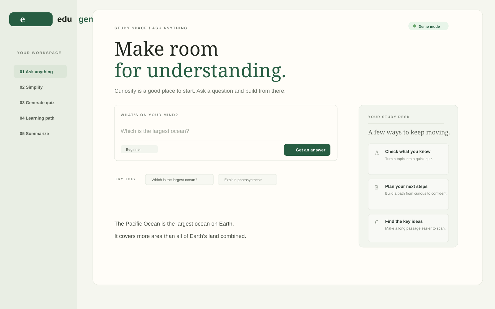

# EduGenie

A lightweight AI-powered educational assistant built for students who want quick, useful answers without a heavy learning platform.

[](https://www.python.org/)
[](https://fastapi.tiangolo.com/)
[](https://github.com/ssubhalakshmie-lang/abcde)

EduGenie helps learners ask questions, simplify unfamiliar concepts, generate quizzes, build structured learning paths, and summarize long educational content. It blends a clean browser experience with a FastAPI backend and works in demo mode without an AI key or with an OpenAI-compatible model when configured.

## Why this project matters

Education often fails when students need fast, trustworthy help. EduGenie addresses that by giving learners a focused assistant that:

- answers questions in a short, clear format
- explains ideas in plain language
- creates practice questions for self-checking
- turns a topic into a step-by-step learning plan
- condenses larger reading material into key points

This makes it practical for real study sessions, revision, and self-paced learning.

## Screenshots



## Core scenarios

1. Ocean question
   - Student asks: Which is the largest ocean?
   - EduGenie returns a concise answer with the key fact.

2. Self-assessment quiz
   - Student selects Generate Quiz for The Pythagoras Theorem.
   - The app creates practice questions and answer key.

3. Structured learning path
   - Leaner asks for a SQL roadmap.
   - The app creates a beginner-to-advanced plan with phases, timeline, and tasks.

## Features

- Ask Anything: quick, guided answers for school or personal learning
- Simplify a Concept: plain-language explanations for difficult ideas
- Generate Quiz: short practice checks for recall and comprehension
- Learning Path Builder: step-by-step plans from beginner to advanced
- Text Summarizer: extract key ideas from passages or notes
- Demo mode fallback: works without AI credentials for local testing
- AI-ready integration: supports OpenAI-compatible providers and local endpoints

## Tech stack

- Backend: FastAPI
- Frontend: HTML, CSS, JavaScript
- Model support: OpenAI-compatible chat-completions API
- Testing: Pytest
- Local runtime: Uvicorn

## Project structure

- app/main.py — FastAPI backend and API routes
- app/static/index.html — browser interface
- app/static/styles.css — responsive styling
- app/static/app.js — frontend interactions
- tests/test_api.py — project validation tests
- .env.example — optional model configuration

## Run locally

```bash
python -m venv .venv
source .venv/bin/activate
pip install -r requirements-dev.txt
uvicorn app.main:app --reload
```

Then open http://127.0.0.1:8000

Without environment variables, the app runs in demo mode. It still supports the requested scenarios and clearly labels demo results instead of pretending to be an AI response.

## Connect an AI model

Set a provider endpoint before starting the app:

```bash
export AI_API_KEY="your-provider-key"
export AI_MODEL="gpt-4o-mini"
export AI_BASE_URL="https://api.openai.com/v1"
uvicorn app.main:app --reload
```

If you are using a local Ollama setup, you can use a local endpoint such as:

```bash
export AI_BASE_URL="http://localhost:11434/v1"
export AI_MODEL="llama3.1"
```

See [.env.example](.env.example) for the available configuration.

## API endpoints

- GET /api/status — checks whether AI mode is configured
- POST /api/study — sends one of the supported actions and learner context
- GET /docs — FastAPI OpenAPI documentation

The study request accepts:

- action: ask, simplify, quiz, path, summarize
- content: the topic or passage to process
- level: beginner, intermediate, advanced

## Testing

```bash
pytest -q
```

The project currently includes focused tests for homepage availability, question answering, quiz generation, learning-path generation, summary output, and validation of empty input.

## Project status

This project is completed and working locally with verified API behavior and a running FastAPI server.

## License

This project is currently distributed as a learning/demo project for educational use.
